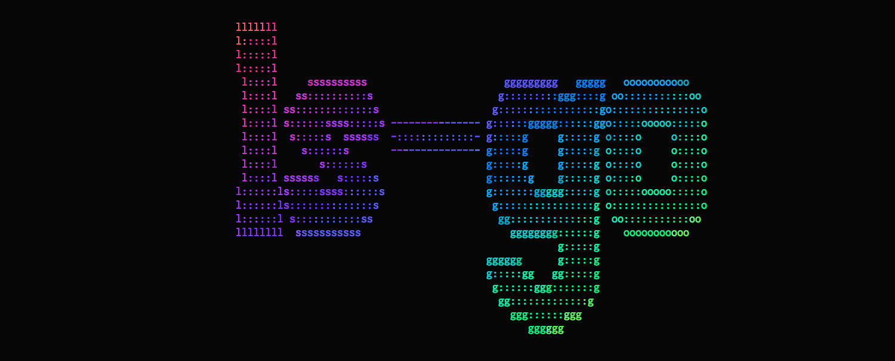
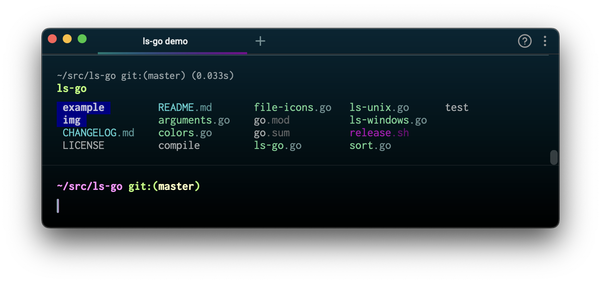
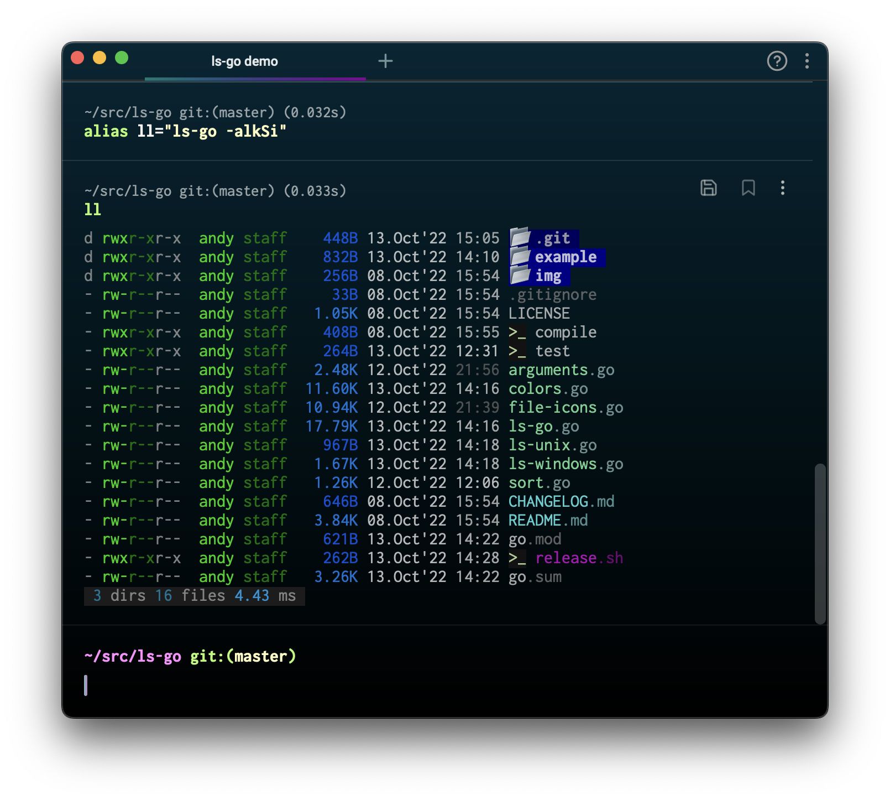
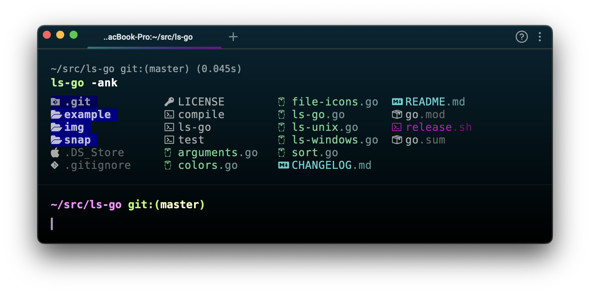
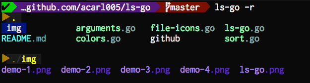
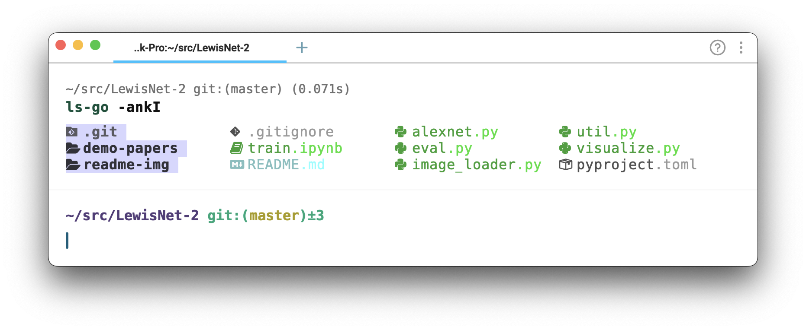

A more colorful, user-friendly implementation of `ls` written in [Go](https://golang.org/).

You want to be able to glean a lot of information as quickly as possible from `ls`.
Colors can help your mind parse the information.
You can configure `ls` to color the output a little bit.
Configuring `ls` is a hassle though, and the colors are limited.

Instead, you can use `ls-go`.
It is highly colored by default.
It has much fewer flags so you can get the behavior you want more easily.
The colors are beautiful and semantic.
A terminal with xterm-256 colors is **required*.*

## Features

- [x] *Should* work on Linux, MacOS, and Windows.
- [x] Outputs beautiful, semantic colors by default.
- [x] Show paths to symlinks, and explicitly show broken links.
- [x] Recurse down subdirectories.
- [x] Emojis (if you're into that).
- [x] Supports [Nerd Fonts](https://github.com/ryanoasis/nerd-fonts).


## Install

With `go get`:

```sh
# do this once in a while
$ go get -u github.com/acarl005/ls-go
```

With Homebrew:

```sh
brew install acarl005/homebrew-formulas/ls-go
```

## Usage



Of course, you can use an alias to save some typing and get your favorite options.



Show locations of symlink.



List subdirectories recursively.




```
usage: ls-go [<flags>] [<paths>...]

Flags:
  -h, --help       Show context-sensitive help (also try --help-long and --help-man).
  -a, --all        show hidden files
  -b, --bytes      include size
  -m, --mdate      include modification date
  -o, --owner      include owner and group
  -p, --perms      include permissions for owner, group, and other
  -l, --long       include size, date, owner, and permissions
  -d, --dirs       only show directories
  -f, --files      only show files
  -L, --links      show paths for symlinks
  -R, --link-rel   show symlinks as relative paths if shorter than absolute path
  -s, --size       sort items by size
  -t, --time       sort items by time
  -k, --kind       sort items by extension
  -S, --stats      show statistics
  -i, --icons      show folder icon before dirs
  -n, --nerd-font  show nerd font glyphs before file names
  -r, --recurse    traverse all dirs recursively
  -F, --find=FIND  filter items with a regexp

Args:
  [<paths>]  the files(s) and/or folder(s) to display
```

### Nerd Font Support

`ls-go` works with [Nerd Fonts](https://github.com/ryanoasis/nerd-fonts).
Simply add `--nerd-font` or `-n` to get file-specific icons.
This won't work unless you have a Nerd Font installed and selected in your terminal emulator.



### Prior Art

This is inspired by [athityakumar/colorls](https://github.com/athityakumar/colorls) and [monsterkodi/color-ls](https://github.com/monsterkodi/color-ls), ported to Go, with various modifications.

## Known Issues

It fails on directories without executable permissions.
The standard `/bin/ls` will also fail when reading non-executable directories,
but only with certain options, like `ls -l`, `ls --color=always` (or `ls -G` on MacOS).
This is because file metadata is needed to determine things like colors,
and directories need to be executable to obtain the metadata of the contents.
For example:

```sh
# create dir without -x permission
$ mkdir -m 644 test

# add a file
$ sudo touch test/foo

# plain `ls` still works
$ /bin/ls test
foo

# but `ls -l` fails
$ /bin/ls -l test

# and so does ls-go
$ ls-go test
```

## Contributing

Contributions are muchly appreciated!
Want to add a glyph for another file type?
Did I forget an edge case?
Is there another option that would be useful?
Submit a PR!
You might want to submit an issue first to make sure it's something I'd want to add though.

